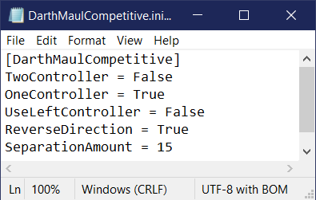

#  Darth Maul Competitive 
The competitive version of the Darth Maul MOD for Beat Saber.  This mod will submit scores but only supports two styles of play:
* Two Controller/Tracker
* One Hand

If both are turned on One Hand takes priority.

All maps when played are converted to No Arrows mode if either mode is on.  There are also the options to:
* ReverseDirection - Reverses both blades direction 180 degrees.  More for One Hand mode with controllers but will reverse the blades in any mode.
* UseLeftController - Switches to the left controller instead of the default right.
* SeparationAmount - The amount to keep the hilts apart in centimetres.

There is no UI yet as the update to Beat Saber 1.6.0 has forced a rewrite of this MOD's UI.  For now you must edit the DarthMaulCompetitive.ini file by hand and restart Beat Saber.  You must **start Beat Saber once** to see this file!



## Requirements
This mod depends on the following mods.  Download them at [BeatMods](https://beatmods.com).

* https://github.com/nike4613/BeatSaber-IPA-Reloaded/
* https://github.com/Kylemc1413/Beat-Saber-Utils
* https://github.com/monkeymanboy/BeatSaberMarkupLanguage

## Installation

Drop the DarthMaulCompetitive.dll file into your Plugins folder under your BeatSaber folder.  Start the game once to generate the INI file and edit the options you want.

## Changelog
### 0.1.0
* Initial build. Adapted from the BSDarthMaul code.

## Local Build
In order to build this project, please add a `DarthMaulCompetitive.csproj.user` file in the project directory and specify where your game is located on your disk:

```xml
<?xml version="1.0" encoding="utf-8"?>
<Project xmlns="http://schemas.microsoft.com/developer/msbuild/2003">
  <PropertyGroup>
    <!-- Change this path if necessary. Make sure it ends with a backslash. -->
    <GameDirPath>C:\Program Files (x86)\Steam\steamapps\common\Beat Saber\</GameDirPath>
  </PropertyGroup>
</Project>
```

